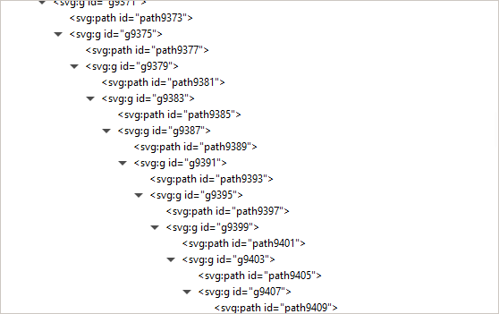
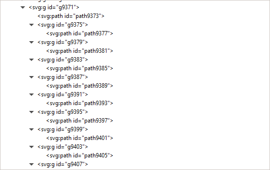

# FlattenSvgLinearGroups

A Python script that flattens SVG groups that are structured as linear trees (groups which have one item plus another nested group, recursively - a linear / degenerate tree).
Can merge basic transforms (`translate` only), groups containing more advanced transforms won't be merged (and instead will be reported to the console).

| Before                     | After                     |
|----------------------------|---------------------------|
|  |  |

## Usage
```
python flatten-svg.py <input SVG file> <output SVG file>
```
